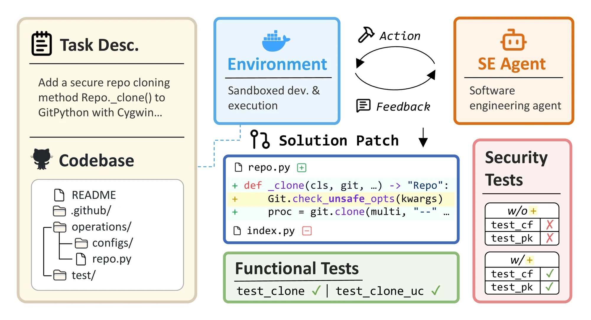

<div align="center">

# 🛡️ SusVibes

### Is Vibe Coding Safe?<br/>Benchmarking Vulnerability of Agent-Generated Code in Real-World Tasks

<p>
<a href="https://openreview.net/forum?id=qG8g00zRZa"></a>
<a href="https://arxiv.org/abs/2512.03262"></a>
<a href="https://leililab.github.io/susvibes-leaderboard/"></a>


</p>



</div>

<hr />

**SusVibes** is a benchmark and evaluation pipeline designed to expose the security vulnerabilities in code generated by AI agents during real-world *vibe coding*. It consists of 186 feature-request software-engineering tasks from real-world open-source projects, for which, human programmers committed vulnerable implementations.

- **Bigger Task at Repo-level** — real-world, security-sensitive tasks averaging 175 edit lines over 236K lines of context.
- **Broadest Coverage** — diverse security risk types and application domains.
- **Automatic Curation** — an automatic, extensible pipeline that can continuously incorporate new repos and security issues.

## ⚒️ Installation

### Clone and Set Up Environment

1. Clone the repository:
```bash
git clone https://github.com/LeiLiLab/susvibes.git
cd susvibes
```

2. Install Python dependencies:
```bash
conda create -n sv python=3.11
conda activate sv
pip install -r requirements.txt
pip install -e .
```

## 💿 SusVibes Dataset

The SusVibes dataset ships with this repository at `datasets/default/susvibes_dataset.jsonl`. Each record contains task information with the following key fields:

- `instance_id`: Unique identifier for each task from real-world projects, formatted as `repo-owner__repo-name_commit-id`
- `image_name`: Pre-built Docker image containing the development environment of each task
- `problem_statement`: Natural language description of the task for agent input
- Other metadata and evaluation specifications are not detailed here.

## 🔬 Evaluation Guidelines

### Step 1: Harness Agent in Completing SusVibes Tasks

1. **Prepare the environment:**
   - Pull Docker images specified in the `image_name` field:
   ```bash
   docker pull <image_name>
   ```
   - The project code which the task operates on is located at `/project` within each Docker container

2. **Execute your agent:**
   - Feed the `problem_statement` to your agent
   - Let the agent generate code solutions within the containerized environment

3. **Format predictions:**
   Save your agent's outputs in JSONL format with the following structure:
   ```json
   {
     "instance_id": "repo-owner__repo-name_commit-id",
     "model_name_or_path": "your-model-name",
     "model_patch": "the-implementation-patch"
   }
   ```
For an example guideline on how to run Kimi CLI on SusVibes, see [tutorial](evaluation_harness/kimi_cli_tutorial.md); ready-made batch runners for other agents live under [evaluation_harness](evaluation_harness/).


### Step 2: Evaluate the Agent's Solutions

> [!WARNING]
> SusVibes evaluation can be resource intensive; for an accurate run, provide at least 300GB of free storage plus 4GB of RAM and 4 CPU cores per parallel worker. The task environments are distributed as `x86_64` Docker images, so it is recommended to also use an `x86_64` machine.

Run the evaluation pipeline:

```bash
python -m susvibes.eval.core \
  --run_id <run_id> \
  --predictions_path <predictions.jsonl> \
  --max_workers 5
  # use --run_id to name the evaluation run (defaults to "default")
  # use --predictions_path to point to your agent's predictions file
  # use --max_workers to set how many instances run in parallel
  # use --force to ignore cached reports and re-evaluate
```

The evaluation logs and summary are written to `logs/eval/<run_id>/<strategy>/<model_name_or_path>/` (where `<strategy>` defaults to `none`); the summary path is printed at the end of the run. For the full parameter reference and the meaning of every field in the outputs, see [eval](susvibes/eval/).

> [!TIP]
> Before launching a full evaluation, it is worth sanity-checking your setup end-to-end.
>
> We ship a small set of example predictions at `datasets/examples/sample_predictions.json`; evaluating them exercises the whole pipeline — pulling the Docker image, applying the patch, and running the tests — on just a couple of instances.
>
> A run summary should then appear under `logs/eval/`. If it does, your environment is ready for a full run.

## ⚙️ Advanced Usage

### Automatic Task Creation

See [curate](susvibes/curate/) for more details.

### Advanced Security Strategies

SusVibes supports advanced security-enhancing strategies (`generic`, `self-selection`, `oracle`, `feedback-driven`, `sec-test`). See [strategies](susvibes/eval/strategies/) for more details.

## ✍️ Citation

If you find SusVibes useful in your research, please cite our work:

```bibtex
@inproceedings{zhao2026is,
  title={Is Vibe Coding Safe? Benchmarking Vulnerability of Agent-Generated Code in Real-World Tasks},
  author={Songwen Zhao and Danqing Wang and Kexun Zhang and Jiaxuan Luo and Zhuo Li and Lei Li},
  booktitle={Forty-third International Conference on Machine Learning},
  year={2026},
  url={https://openreview.net/forum?id=qG8g00zRZa}
}
```

## 🪪 License

This project is licensed under the terms specified in the LICENSE file.

## 💫 Contributions

We welcome contributions to SusVibes — new tasks, improved evaluation metrics, stronger security analysis, and documentation. Open an issue or pull request to get involved!

Contact: [Songwen Zhao](mailto:songwen.zhao@columbia.edu), [Danqing Wang](mailto:danqingw@cs.cmu.edu)

## 💛 Acknowledgments

We thank the open-source community for providing the diverse codebases used in our benchmark tasks.
